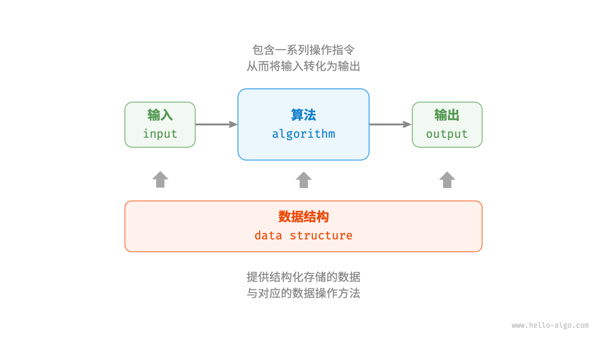

# 算法是什么

## 算法定义

<u>算法（algorithm）</u>是在有限时间内解决特定问题的一组指令或操作步骤，它具有以下特性。

- 问题是明确的，包含清晰的输入和输出定义。
- 具有可行性，能够在有限步骤、时间和内存空间下完成。
- 各步骤都有确定的含义，在相同的输入和运行条件下，输出始终相同。

## 数据结构定义

<u>数据结构（data structure）</u>是计算机中组织和存储数据的方式，具有以下设计目标。

- 空间占用尽量少，以节省计算机内存。
- 数据操作尽可能快速，涵盖数据访问、添加、删除、更新等。
- 提供简洁的数据表示和逻辑信息，以便算法高效运行。

**数据结构设计是一个充满权衡的过程**。如果想在某方面取得提升，往往需要在另一方面作出妥协。下面举两个例子。

- 链表相较于数组，在数据添加和删除操作上更加便捷，但牺牲了数据访问速度。
- 图相较于链表，提供了更丰富的逻辑信息，但需要占用更大的内存空间。

## 数据结构与算法的关系

如下图所示，数据结构与算法高度相关、紧密结合，具体表现在以下三个方面。

- 数据结构是算法的基石。数据结构为算法提供了结构化存储的数据，以及操作数据的方法。
- 算法是数据结构发挥作用的舞台。数据结构本身仅存储数据信息，结合算法才能解决特定问题。
- 算法通常可以基于不同的数据结构实现，但执行效率可能相差很大，选择合适的数据结构是关键。

数据结构与算法犹如下图所示的拼装积木。一套积木，除了包含许多零件之外，还附有详细的组装说明书。我们按照说明书一步步操作，就能组装出精美的积木模型。

两者的详细对应关系如下表所示。

| 数据结构与算法 | 拼装积木                                 |
| -------------- | ---------------------------------------- |
| 输入数据       | 未拼装的积木                             |
| 数据结构       | 积木组织形式，包括形状、大小、连接方式等 |
| 算法           | 把积木拼成目标形态的一系列操作步骤       |
| 输出数据       | 积木模型                                 |

值得说明的是，数据结构与算法是独立于编程语言的。正因如此，本书得以提供基于多种编程语言的实现。

!!! tip "约定俗成的简称"

    在实际讨论时，我们通常会将“数据结构与算法”简称为“算法”。比如众所周知的 LeetCode 算法题目，实际上同时考查数据结构和算法两方面的知识。

## 小结

- 算法在日常生活中无处不在，并不是遥不可及的高深知识。实际上，<u>我们已经在不知不觉中学会了许多算法</u>，用以解决生活中的大小问题。
- 查字典的原理与二分查找算法相一致。二分查找算法体现了分而治之的重要算法思想。
- 整理扑克的过程与插入排序算法非常类似。插入排序算法适合排序小型数据集。
- 货币找零的步骤本质上是贪心算法，每一步都采取当前看来最好的选择。
- 算法是在有限时间内解决特定问题的一组指令或操作步骤，而数据结构是计算机中组织和存储数据的方式。
- 数据结构与算法紧密相连。数据结构是算法的基石，而算法是数据结构发挥作用的舞台。
- 我们可以将数据结构与算法类比为拼装积木，积木代表数据，积木的形状和连接方式等代表数据结构，拼装积木的步骤则对应算法。

## Q & A

**Q**：作为一名程序员，我在日常工作中从未用算法解决过问题，常用算法都被编程语言封装好了，直接用就可以了；这是否意味着我们工作中的问题还没有到达需要算法的程度？

如果把具体的工作技能比作是武功的“招式”的话，那么基础科目应该更像是“内功”。

我认为学算法（以及其他基础科目）的意义不是在于在工作中从零实现它，**而是基于学到的知识，在解决问题时能够作出专业的反应和判断，从而提升工作的整体质量**。举一个简单例子，每种编程语言都内置了排序函数：

- 如果我们没有学过数据结构与算法，那么给定任何数据，我们可能都塞给这个排序函数去做了。运行顺畅、性能不错，看上去并没有什么问题。
- 但如果学过算法，我们就会知道内置排序函数的时间复杂度是 $O(n \log n)$ ；而如果给定的数据是固定位数的整数（例如学号），那么我们就可以用效率更高的“基数排序”来做，将时间复杂度降为 $O(nk)$ ，其中 $k$ 为位数。当数据体量很大时，节省出来的运行时间就能创造较大价值（成本降低、体验变好等）。

在工程领域中，大量问题是难以达到最优解的，许多问题只是被“差不多”地解决了。问题的难易程度一方面取决于问题本身的性质，另一方面也取决于观测问题的人的知识储备。人的知识越完备、经验越多，分析问题就会越深入，问题就能被解决得更优雅。

