# 设计模式

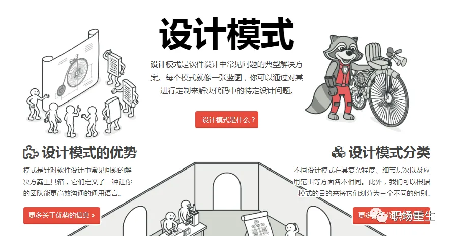

> 在软工程中，设计模式（design pattern）是对软件设计中普遍存在（反复出现）的各种问题，所提出的解决方案。这个术语是由埃里希·伽玛（Erich Gamma）等人在1990年代从建筑设计领域引入到计算机科学的，设计模式是针对软件设计中常见问题的工具箱，其中的工具就是各种经过实践验证的解决方案。即使你从未遇到过这些问题，了解模式仍然非常件有用，因为它能指导你如何使用面向对象的设计原则来解决各种问题。

大家好，这里是极客重生，今天谈一谈设计模式，一名优秀的开发，应该多少都需要了解一些常用的设计模式和使用场景，让我们一起来重温一下那些年经典设计模式；

本文主要内容：

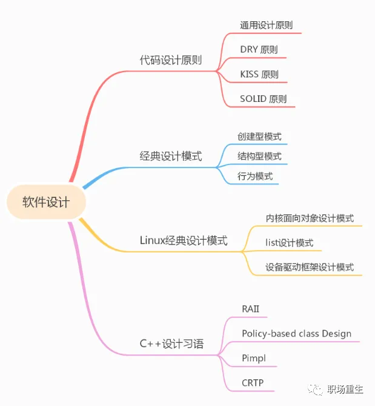

## 为什么要掌握设计模式

### 历史的教训

时间回到 20 世纪 80 年代，当时的软件行业正处于第二次软件危机中。根本原因是，随着软件规模和复杂度的快速增长，如何高效高质的构建和维护这样大规模的软件成为了一大难题。无论是开发何种软件产品，成本和时间都最重要的两个维度。较短的开发时间意味着可比竞争对手更早进入市场；较低的开发成本意味着能够留出更多营销资金，因此能更广泛地覆盖潜在客户。

### 设计模式是银弹吗？

**代码复用**是减少开发成本，减低复杂度最常用的方式之一，这个想法表面看起来很棒，但实际上要让已有代码在全新的上下文中工作，通常还是需要付出额外努力的。组件间紧密的耦合、对具体类而非接口的依赖和硬编码的行为都会降低代码的灵活性，使得复用这些代码变得更加困难。设计模式目标就是帮助软件提高内聚，减低耦合，使用设计模式是增加软件组件灵活性并使其易于复用的方式之一。

**变化**是程序员生命中唯一不变的事情，客户需求可能经常会变，紧急上线的版本，要不要下次重构一下，还是继续打各种补丁， 技术债会越积越多，因此在设计程序架构时，所有有经验的开发者会尽量选择支持未来任何可能变更的方式。可扩展性成为了程序设计必须要考虑指标，而设计模式是可以借鉴的，成熟的优化程序设计的解决方案；

总体来说，深刻理解设计模式会给我们带来很多好处：

1. 可以和面试官"畅谈"设计模式相关问题.
2. *很多开源软件框架大量使用了设计模式*，比如Linux系统，Redis，Spring，C++STL等等，可以把帮你加快理解开源软件框架。
3. 当你写的代码越来越优美后，*你的代码鉴赏能力就会提高*，对团队code review贡献也会更大，在个人影响力也会提高。
4. 你不会再畏手畏脚，你的工具箱里面工具很多后，可以帮助你，*应对各种大型项目的代码设计和开发*。
5. 每个领域都会一些成熟"套路", 编程也不例外，*熟悉这些套路*，可以更好方便交流和更快速地解决问题；

为了更好理解设计模式，我们首先要理解一些重要的设计原则，而不是片面理解设计模式哪些模式名词，要看清楚这背后的原理，这个才是最重要的。

## 代码设计原则

代码设计原则贯穿在整个设计模式之中，是理解其中的精华，本文讨论了一些重要的设计原则，包括通用设计原则，DRY原则，KISS原则，SOLID原则等：

### 通用设计原则

1. <u>隔离变化</u> 

找到程序中的变化内容并将其与不变的内容区分开，该原则的主要目的是将变更造成的影响最小化。

2. <u>面向接口编程</u> 

面向接口进行开发， 而不是面向实现；依赖于抽象类型，而不是具体类，**要求接口标准化设计，**只要对外的接口没有变，*内部实现就可以任意变化*，为以后留有更多优化空间，方便以后更新迭代，可以说这样的设计是灵活的。

3. <u>组合优于继承</u> 

继承可能是类之间最明显、最简便的代码复用方式。如果你有两个代码相同的类， 就可以为它们创建一个通用的基类，然后将相似的代码移动到其中。*但继承可能带来的问题*：

- **子类不能减少超类的接口**。你必须实现父类中所有的抽象方法，即使它们没什么用。
- **在重写方法时，你需要确保新行为与其基类中的版本兼容**。这一点很重要，因为子类的所有对象都可能被传递给以超类对象为参数的任何代码，相信你不会希望这些代码崩溃的。
- **继承打破了超类的封装**，因为子类拥有访问父类内部详细内容的权限。此外还可能会有相反的情况出现，那就是程序员为了进一步扩展的方便而让超类知晓子类的内部详细内容。
- **子类与超类紧密耦合**。超类中的任何修改都可能会破坏子类的功能。
- **通过继承复用代码可能导致平行继承体系的产生**。继承通常仅发生在一个维度中。只要出现了两个以上的维度，你就必须创建数量巨大的类组合，从而使类层次结构膨胀到不可思议的程度。

组合是代替继承的一种方法。继承代表类之间的“是”关系（汽车是交通工具），而组合则代表“*有*”关系（汽车有一个引擎）。

> 继承的弊端重点记一下，在小型项目中可能还体现不出来，但当工程一旦庞大，这些问题会非常突出。

### 1 DRY 原则

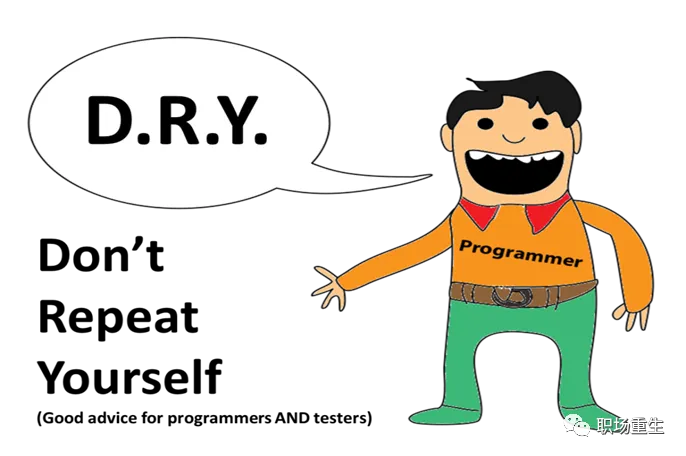

**DRY**-Don't Repeat Yourself（不要重复代码）

*降低可管理单元的复杂度的基本策略是将系统分成多个部分。*

理解这一原理是如此重要，它通常以首字母缩写词DRY来指代，并出现在Andy Hunt和Dave Thomas的书《实用程序员》中，但是这个概念本身已经有很长时间了。它指的是软件的最小部分。

当您构建一个大型软件项目时，通常会因整体复杂性而感到不知所措。人类不善于管理复杂性；他们擅长为特定范围的问题找到有创意的解决方案。降低可管理单元的复杂性的基本策略是**将系统分成更方便的部分**。首先，您可能希望将系统分为多个组件，**其中每个组件代表其自己的子系统**，其中包含完成特定功能所需的一切。

### 2 KISS 原则

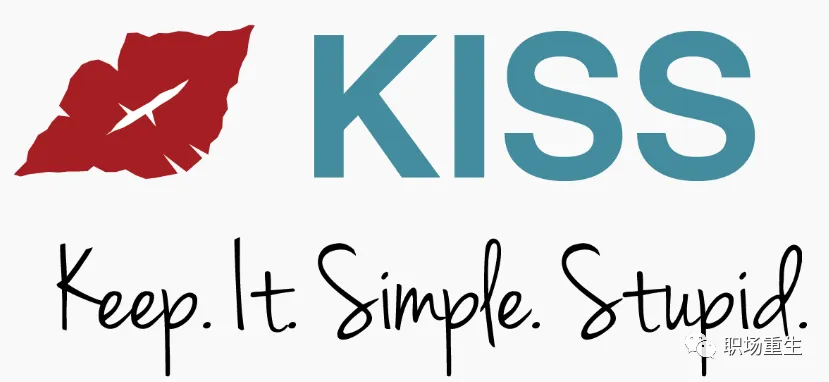

KISS是使它保持简单，愚蠢的首字母缩写，是美国海军在1960年提出的设计原则。KISS原则指出，大多数系统如果保持简单而不是变得复杂，则效果最佳。因此，简单性应该是设计的主要目标，并且应该避免不必要的复杂性。

### 3 SOLID 原则

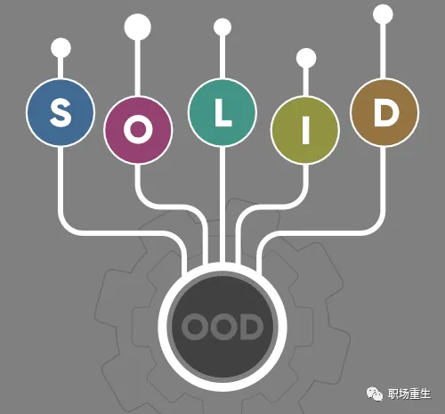

SOLID 原则是在罗伯特·马丁的著作《敏捷软件开发：原则、模式与实践》中首次提出的，SOLID 是让软件设计更易于理解、更加灵活和更易于维护的五个原则的简称。

#### S：单一职责 原子函数

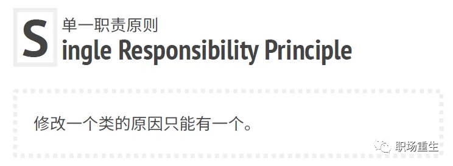

尽量让每个类或者函数只负责软件中的一个功能，这条原则的主要目的是减少复杂度，你不需要费尽心机地去构思如何仅用200 行代码来实现复杂设计，实际上完全可以使用十几个清晰的方法，这里核心是：通过实现最基本"**原子函数**", 其他复杂功能都可以通过这些原子函数构建，每一层的函数语义都是单一的，通过层层封装，最终构建一个庞大可控的系统。

#### O：扩展开放 修改封闭

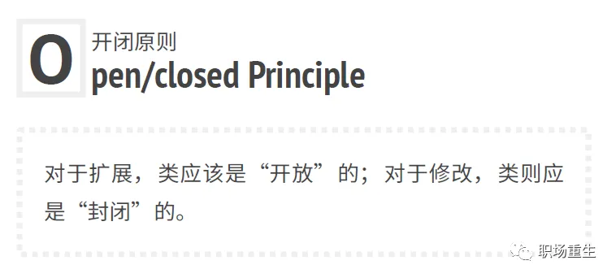

 本原则的主要理念是在实现新功能时能保持已有代码不变，为什么呢，主要是修改存量代码，很可能会影响软件稳定性，很多线上代码跑了好多年了，经历很多轮迭代，各种补丁，如果考虑不全面，很容易带来风险，下图比较形象说明：

#### L：无需感知 直接替换

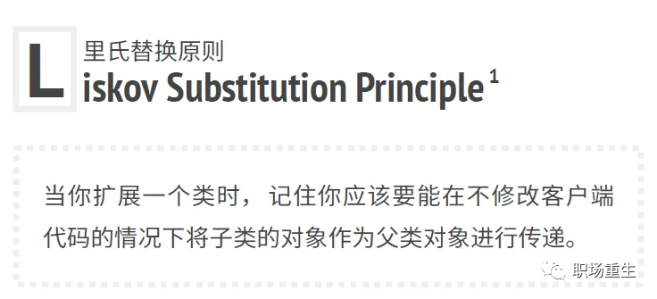

替换原则是用于预测*子类是否与代码兼容*，以及*是否能与其超类对象协作*的一组检查。这一概念在开发程序库和框架时非常重要， 因为其中的类将会在他人的代码中使用——你是无法直接访问和修改这些代码的。**里氏替换原则的重点在不影响原功能**。

#### I：接口隔离 不用强迫

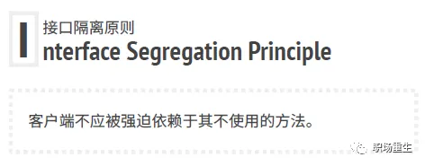

根据接口隔离原则，你必须将“臃肿”的方法拆分为多个颗粒度更小的具体方法。客户端必须仅实现其实际需要的方法。否则，对于“臃肿”接口的修改可能会导致程序出错，即使客户端根本没有使用修改后的方法。

#### D：抽象接口 不依赖 具体实现

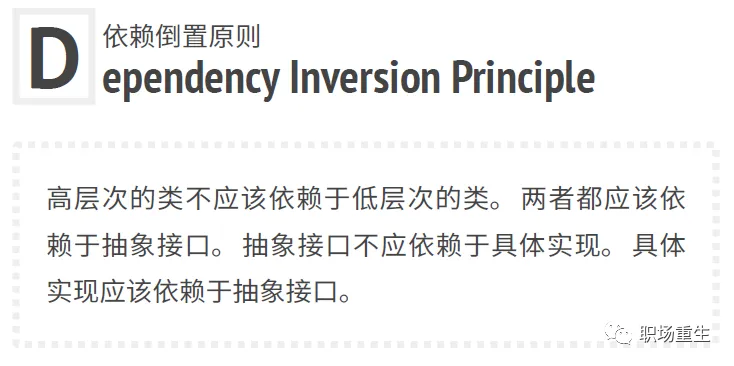

通常在设计软件时，你可以辨别出不同层次的类。

- 低层次的类实现基础操作（例如磁盘操作、传输网络数据和连接数据库等）。
- 高层次类包含复杂业务逻辑以指导低层次类执行特定操作。

## 经典设计模式

这里列举了22种设计模式，大致分为三类：**创建型模式**，**结构型模式**，**行为模式**；

### 创建

**创建型模式**提供创建对象的机制，增加已有代码的灵活性和可复用性

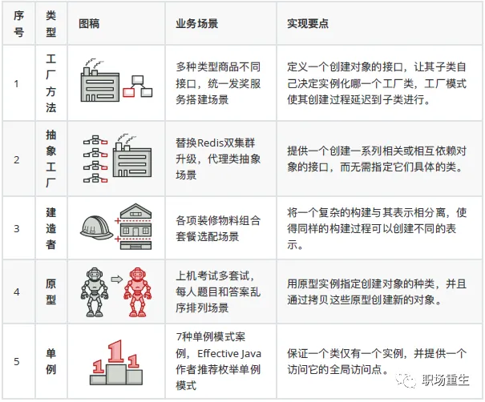

### 结构

**结构型模式**介绍如何将对象和类组装成较大的结构，并同时保持结构的灵活和高效:

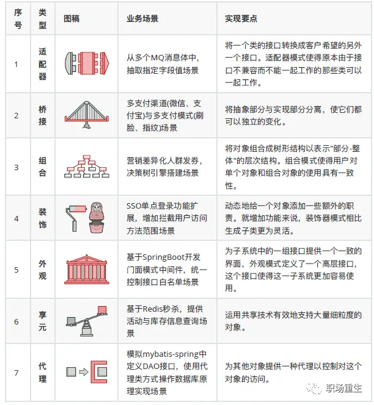

### 行为

**行为模式**负责对象间的高效沟通和职责委派:

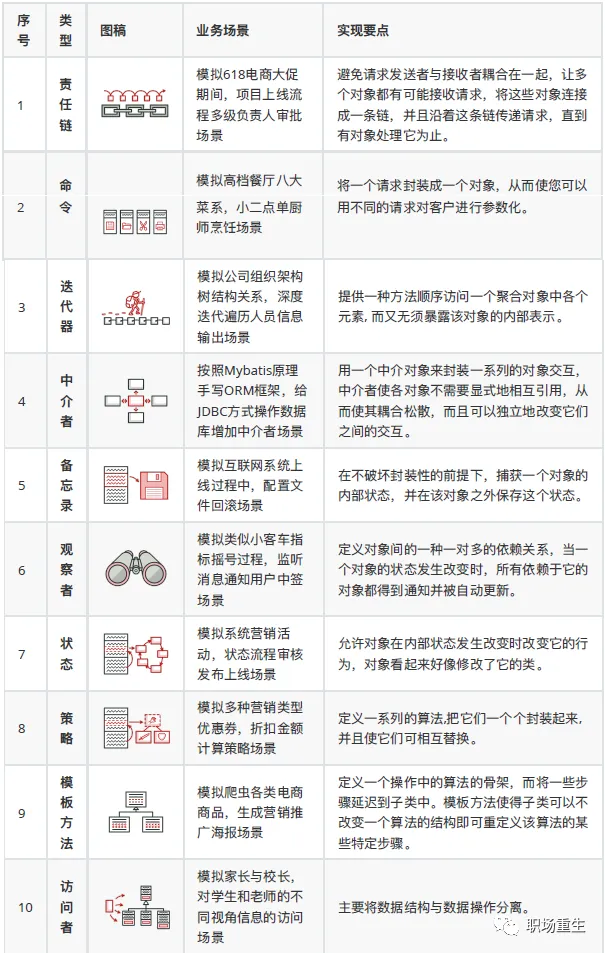

### 推荐

推荐一个经典学习网站：

https://refactoring.guru

上面每种模式配有形象图，比如工厂方法模式：

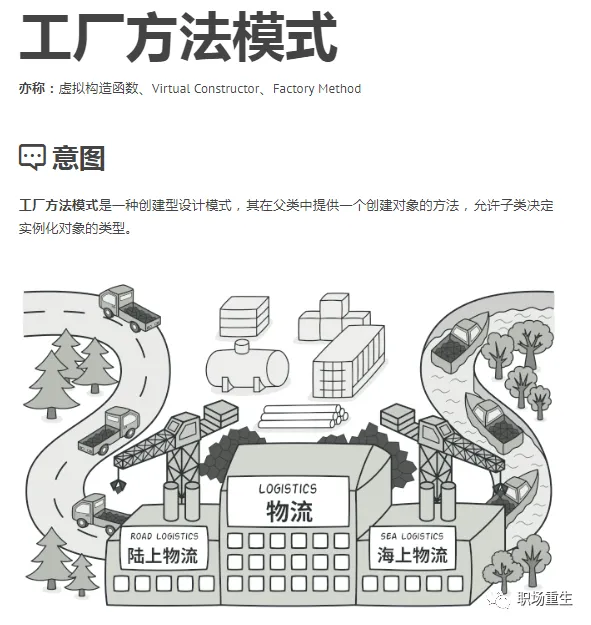

还提供对应的设计类图：

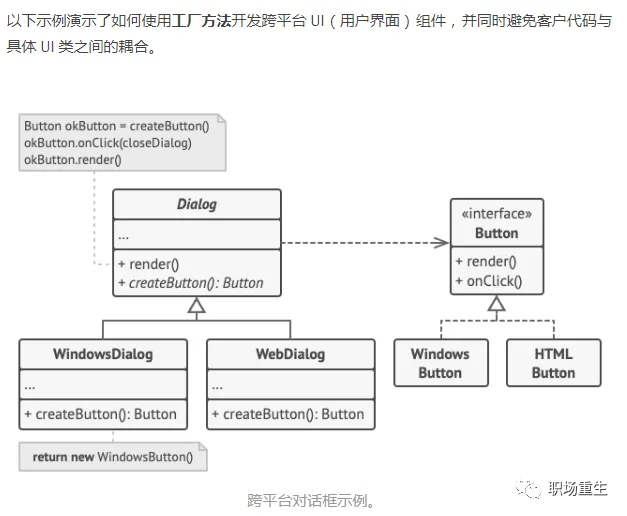

也提供了对应代码示例：

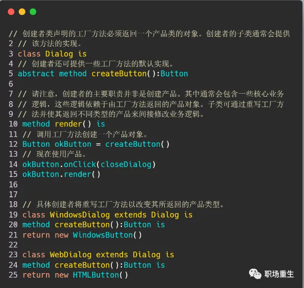

支持9种语言的实现：

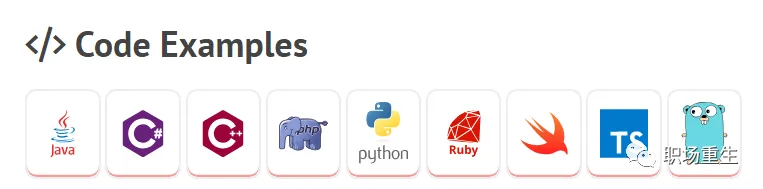

代码在：https://github.com/RefactoringGuru

更多请参考：《设计模式：可复用面向对象软件的基础》

## Linux经典设计模式

### 内核面向对象设计模式

Linux虽然是面向过程的c语言写成的，但是却可以表达*面向对象的思想*，Linux内核大量使用面向对象的编码风格，我们可以从中至少学习到两点：

- 说明在大型软件开发中，OOP编程思想很重要，**和具体语言无关**；
- 同时展示了怎么用c语言实现OOP编程，值得广大C语言开发者学习。

我们用例子来说明。

#### 封装

以内核proto定义为例：

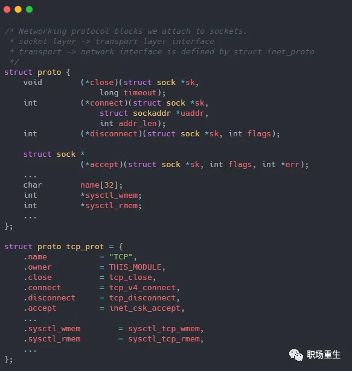

struct proto 定义传输层接口方法和相应成员数据，类似C++的class定义；可以根据这个class生产很多实例，比如TCP实例，可以通过统一接口访问TCP实例的方法和数据。

#### 继承

以内核套接字体系为例：

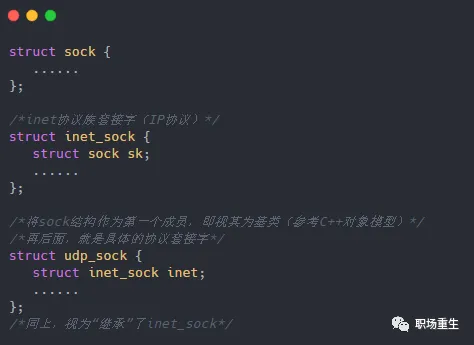

基于此继承体系，对于一些接受 struct sock* 形参的接口，就可以直接把上述的子类套接字实例 struct udp_sock* sk作为实参传进去（当然，这里需要指针强转一次(struct sock*)sk）。这里就是OOP中“is a"的public继承关系，子类对象可以直接作为父类对象使用，并且这种实现只支持单继承。

#### 多态

用C实现多态需要自己维护继承关系中的虚函数体系，C++有编译器自动生成、维护vtbl与vptr。Linux内核的实现中，*将系列函数指针放入结构体*，即视其为“**虚函数**”，亦或是专门定义*一个xxx_ops结构，里面放上一堆函数指针*，作为“**虚函数表**”。仍以套接字体系为例，在基类 sock 中，有协议结构体指针 struct proto *skc_prot; 这个proto即可大体上视为一个虚函数表vtbl，内有具体协议的函数指针，而这个skc_prot指针，即可视为虚指针vptr。

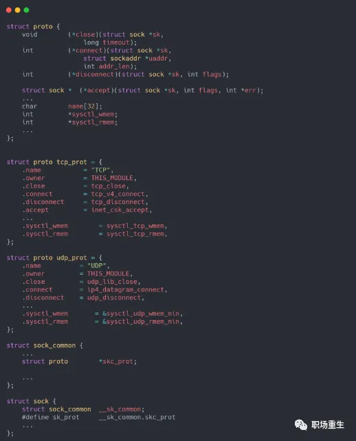

在套接字创建时，根据参数中的协议族、协议类型、协议号信息，调用协议族的create函数执行创建，绑定具体协议proto指针到该vptr上，自此实现了静态类型到动态类型的绑定。之后，当调用虚函数时，即可直接通过这些函数指针进行多态的调用 , 比如下面例子socket调用connect接口：

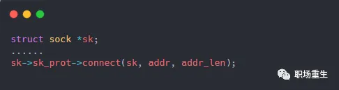

这里第一个参数sk即可看做this指针，不同socket对象，会访问对应协议接口,从而实现多态访问：

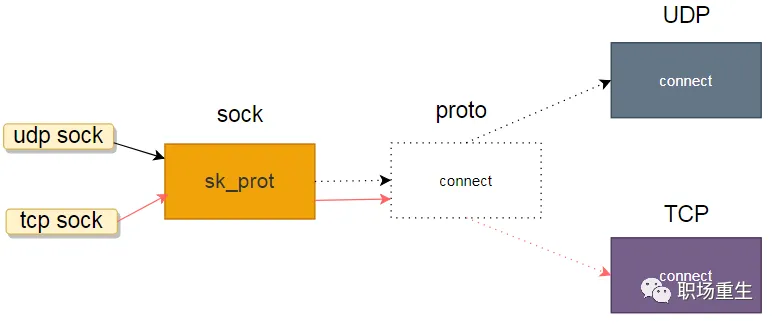

### list / 红黑树

list作为常用数据结构，写代码时候经常会遇到，可以看一下传统list设计和内核list设计有什么不一样。

一般的双向链表一般是如下的结构:

- 有个单独的头结点(head)
- 每个节点(node)除了包含必要的数据之外，还有2个指针(pre,next)
- pre指针指向前一个节点(node)，next指针指向后一个节点(node)
- 头结点(head)的pre指针 指向 链表的最后一个节点
- 链表的最后一个节点的next指针 指向 头结点(head)

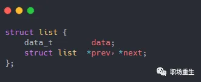

传统list如下图：

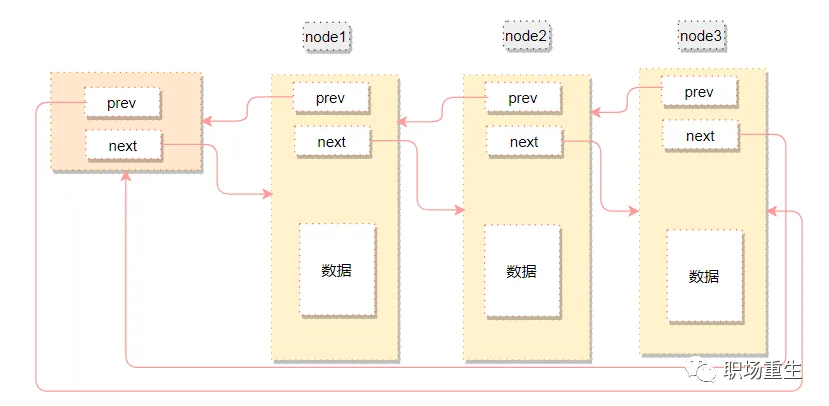

传统的链表不同node类型，需要重新定义结构，不够通用化，还需要为node实现脱链、入链操作等。

我们需要抽象出一个“基类”来实现链表的功能，其他数据结构只需要简单的继承这个链表类就可以了。

**内核list**设计如下：

- 链表不是将用户数据保存在链表节点中，而是将链表节点**保存在**用户数据中
- 链表节点只有2个指针(prev和next)
- prev指针 指向 前一个节点的链表节点
- next指针 指向 后一个节点的链表节点

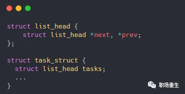

如下图：

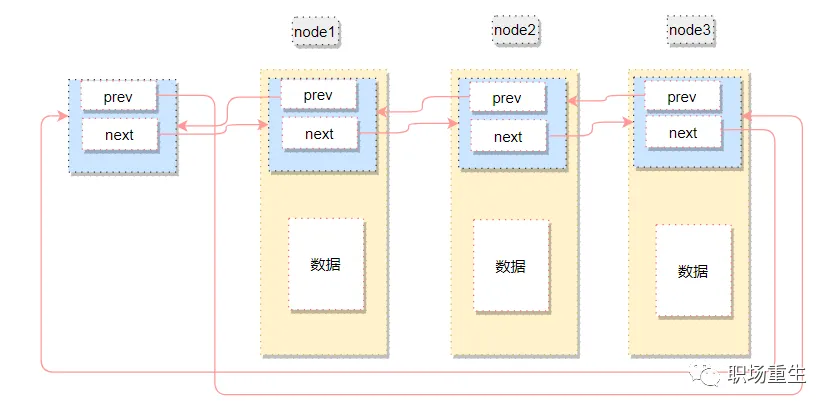

这样设计的好处是链表的节点将独立于用户数据之外，便于把链表的操作独立出来，和具体数据节点无关，这里可能有些人会问，数据节点怎么访问呢？ 内核通过*一个container_of的宏*从链表节点找到数据节点起始地址：

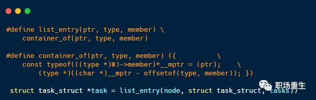

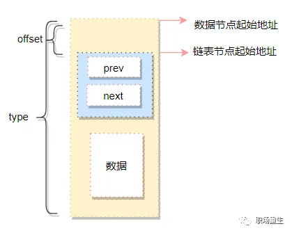

找到数据节点起始地址后，通过数据节点定义就可以访问数据了，内核红黑树rbtree也是同样的设计。

### 驱动框架 / 中介模式

 从Linux2.6开始Linux加入了一套驱动管理和注册机制—platform平台总线驱动模型:

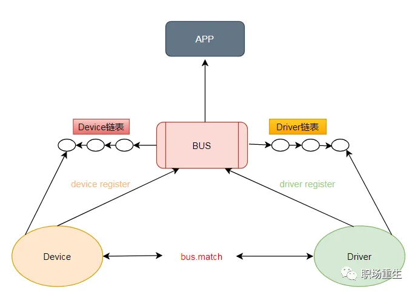

当调用platform_device_register（或platform_driver_register）注册platform_device（或platform_driver）时，首先会将其加入platform总线上，依次匹配platform总线上的platform_driver（或platform_device），然后调用platform_driver的`.probe函数`。

- 其中platform_device存放设备资源（硬件息息相关代码，易变动），
- platform_driver则使用资源（比较稳定的代码），
- 这样当改动硬件资源时，我们的上层使用资源的代码部分几乎可以不用去改动。

这里设计通过**中间bus层**，把强耦合Device和对应Driver进行了解耦隔离，定好`match`，`probe`等标准通信接口，就可以独立开发，通过总线bus进行关联通信，有点类似中介模式。

## C++ Idioms（设计习语）

由于篇幅优先，这里列举一些非常重要且非常实用的C++专有的设计模式。

### RAII-资源获取即初始化

Resource Acquisition Is Initialization

‘资源获取即初始化‘（简称 RAII）是C++*防止内存泄露*一个很好解决方案，它结合构造函数和析构函数，把**资源生命周期**和**对象生命周期**绑定起来，在构造函数中获取资源（这些错误会引发异常），然后将其释放到析构函数中（永不抛出），并且不需要显式清理，从而防止忘记释放资源；

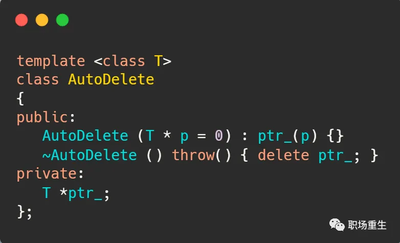

 C ++STL库很多类遵循RAII设计原则，比如std :: string，std :: vector，std :: thread等。

### Policy - based class Design

基于策略设计又名policy-based class design 是一种基于C++计算机程序设计模式，以**策略**（Policy）为基础，并结合C++的模板元编程。就是将原本复杂的系统，拆解成多个独立运作的“**策略类别**”，每一组policy class都只负责单纯如行为或结构的某一方面。

- 多重继承由于继承自多组 Base Class，故缺乏型别消息，而Templetes基于型别，拥有丰富的型别消息。
- 多重继承容易扩张，而Templetes的特化不容易扩张。

Policy-Based Class Design **同时使用了** Template 以及 Multiple Inheritance 两项技术，结合两者的优点，看下面例子：

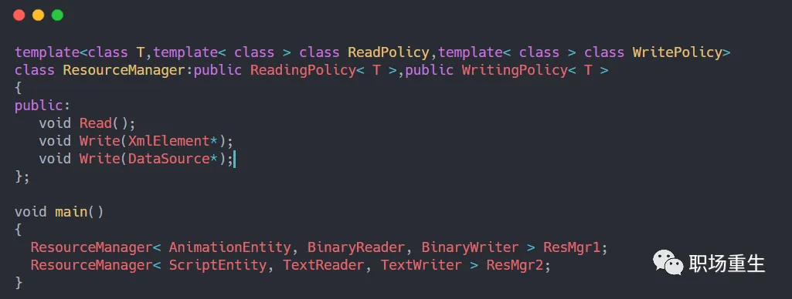

ResourceManager则称为**宿主类别**（host class），只需要切换*不同 Policy Class*（ReadPolicy or WritePolicy），就可以得到*不同的功能实体*。Policy不一定要被宿主继承，只需要用**委托**完成这一工作。但policies必须遵守*一个隐含的constraint*，接口必须一样，故参数不能有巨大改变，policy 的一个重要的特征是，宿主类别经常（并不一定要）使用多重继承的机制去使用多个 policy classes。

因此在进行 policy 拆解时，必须要尽可能达成<u>正交分解</u>，policy之间最好彼此独立运作，不相互影响。

### Pimpl - Pointer to implementation

Pimpl是一种广泛使用的削减编译依赖项的技术, 看下面例子可能就明白了：

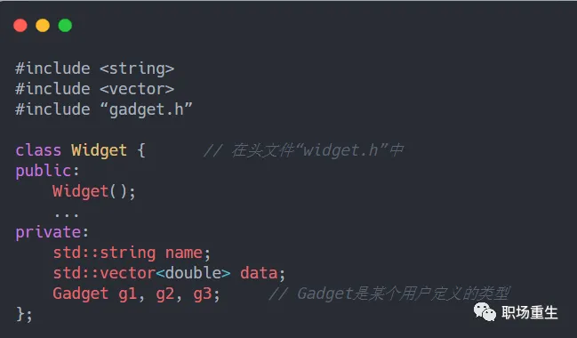

因为Widget的成员变量有std::string，std::vector和Gadget，那么这些类型的头文件在Widget编译时必须出现，这意味Widget的用户必须包含“gadget.h”。这些增加的头文件会增加Widget用户的编译时间，而且这使得用户依赖于这些头文件，即如果某个头文件的内容被改变了，Widget的用户就要重新编译。标准库头文件不会经常改变，但是“gadget.h”可能会经常修改。所以需要Pimp技术来消除这种变化影响——*隔离变化*；

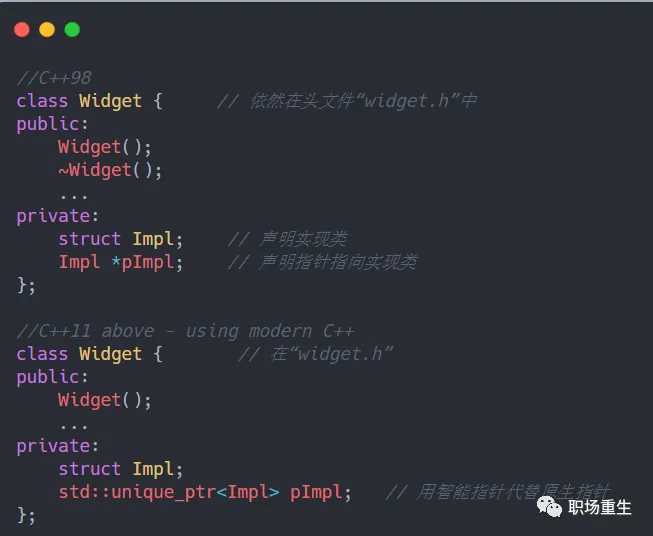

这样Widget头文件里面就不需要包含“gadget.h”文件了，再CPP文件中再声明具体的类型：

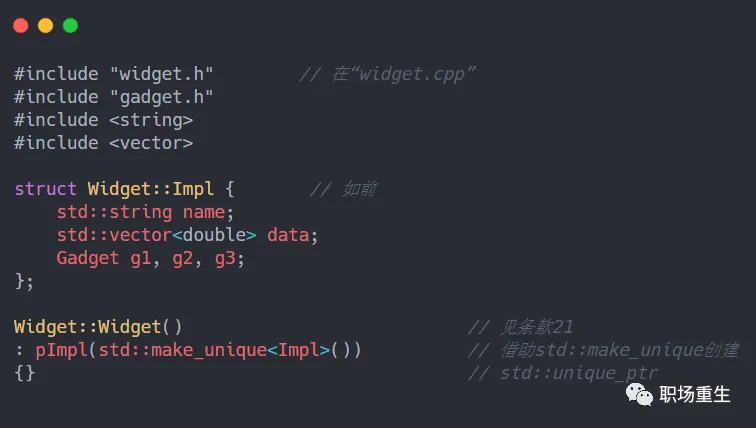

在这里，我展示了“#include”指令，只为了说明所有对头文件的依赖（即std::string，std::vector和Gadget）依然存在。不过呢，依赖已经从“widget.h”（Widget用户可见的和使用的）转移到“widget.cpp”(只有Widget的实现者才能看见和使用)，这样就把widget头文件变化影响隔离在内部实现中，对外接口不变，这里就体会到这种设计模式的好处。

### CRTP - 奇异递归模板模式

The curiously recurring template pattern 

CRTP (奇异递归模板模式）是一种在编译期实现多态方法，是对运行时多态一种优化，多态是个很好的特性，但是动态绑定比较慢，因为要查虚函数表。而使用 CRTP，完全消除了动态绑定，降低了继承带来的虚函数表查询开销。

CRTP包含：

- 从模板类继承，
- 使用派生类本身作为基类的模板参数。

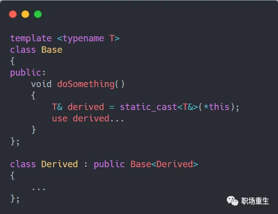

这样做的目的是在基类中使用派生类。从基础对象的角度来看，派生对象本身就是对象，但是是向下转换的对象。因此，基类可以通过将static_cast自身放入派生类来访问派生类。

## 总结

为什么要掌握设计模式，软件危机带来刚性要求，设计模式提倡的高内聚，低耦合，代码复用，可扩展性等思想，可以给我们软件设计带来一些思考，有了思考，就会产生一些积极变化；

- 理解设计模式前提，是要理解背后的设计原则，这是整个设计模式的精华；
- 经典的设计模式包含22种设计模式（没有解释器模式，日常开发中，很少使用），大致分为三类：创建型模式，结构型模式，行为模式；
- Linux系统里面包含大量设计模式思想，面向对象设计，List/Rbtree抽象设计，驱动框架bus总线解耦设计，都值得我们学习；

每种编程语言都会有一些独特特殊习惯用法，Java的MVC，Golang的对象池模式(Object Pool)等，文中列举的C++一些常见的惯用法RAII，Policy-based Design ，Pimpl，CRTP等，对C++开发来说，了解和掌握他们，对于特定场景问题多了一些好的解决方案。

设计模式是银弹吗？不是，就像软件工程也不是银弹一样，这些都只是工具，关键还是看是否真正理解其背后反射出的设计精髓，我们需要多一些批判性的思考，没有绝对好坏，软件设计的最终方案很多时候都是权衡（trade-off）结果，但我们的长期目标始终没有变化。

