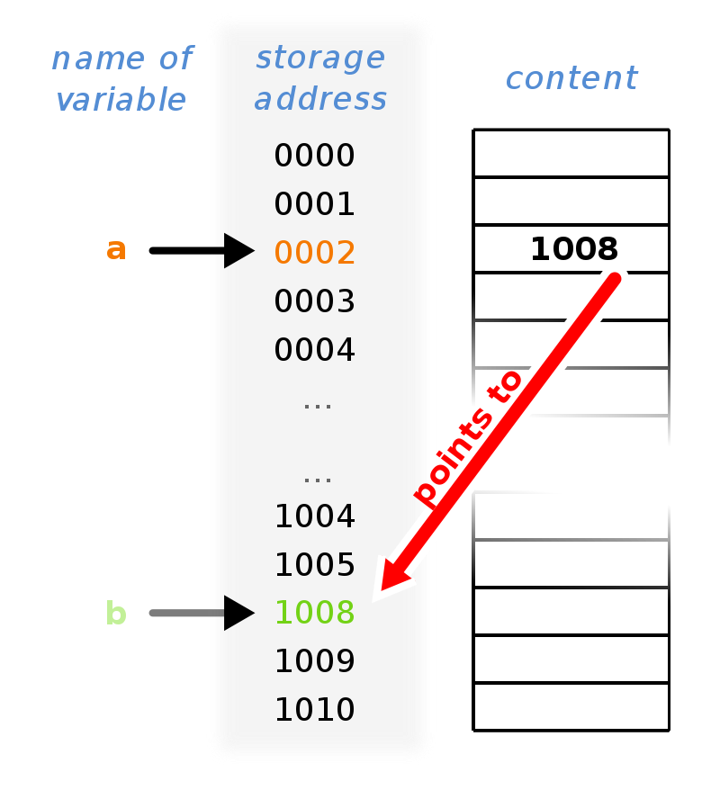
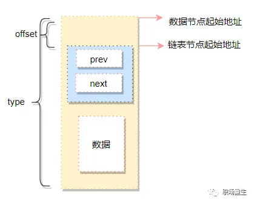

# 聊聊C语言和指针的本质

大家好，今天我们聊一聊C语言的指针。



来源：https://blog.csdn.net/dog250/article/details/103221309

很多编程语言都以 “没有指针” 作为自己的优势来宣传，然而，对于C语言，指针却是与生俱来的。

那么，什么是指针，为什么大家都想避开指针。

很简单， 指针就是==地址==，当一个地址作为==一个变量==存在时，它就被叫做==指针==，该变量的类型，自然就是==指针类型==。

指针的作用就是，给出一个指针，*取出 该指针指向地址处 的值*。为了理解本质，我们从计算机模型说起。

宏观看来，计算机可以分为两类：

1. **存储-执行计算机**：这类机器典型的例子就是我们平时使用的计算机，有一个CPU，有一个内存，CPU仅包含运算逻辑，所有的指令和数据都在内存中，内存仅供存储，不包含任何运算组件。
2. **现场编程计算机**：这类机器的典型例子就是ASCI电路，FPGA这种。直接针对特定的需求构建逻辑电路，然而，由于存在笛卡尔积的问题，不太适合通用计算。

所以我们只需看平时使用的第一类**存储-执行模型**的计算机工作模式：

- CPU在地址总线上发射一个地址到内存。
- 内存把特定地址对应的数据返回到数据总线。
- 看起来，通用计算机就是通过指针完成所有工作的。

<u>CPU没有能力直接操作内存里的值</u>，它必须做以下的操作以迂回：

1. 从特定地址A0取出值V0。
2. 对V0进行加工运算生成V1。
3. 将V1存入特定地址A1。

太初，人们就是按照以上的这么个逻辑编程的，这就是汇编语言：

```assembly
mov    -0x4c(%rbp),%ebx
```

然而，这样太麻烦了，C语言随着简单通用的UNIX操作系统而生，下面的语句看起来更加方便：

```c
int a = 10;
char *p = &a;
*p = 13;
```

<u>C语言 直接映射了 CPU的工作方式</u>，而且是用极其简单的方式，这就是**C语言的艺术**。这就是C指针的背景。

> 这段C代码展示了几个关键概念，包括变量声明、类型转换和指针操作。让我们逐步分析这段代码：
>
> 1. `int a = 10;`：这行代码声明了一个整型变量`a`，并将其初始化为10。
>
> 2. `char *p = &a;`：这行代码声明了一个指向字符的指针`p`，并将它的地址设置为`a`的地址。这里发生了隐式类型转换，因为`a`是一个整数，而`p`是一个指向字符的指针。在C语言中，整数和字符之间可以进行隐式类型转换，因为字符实际上是整数的一个子集。但是，这种类型转换可能会导致一些问题，因为整数和字符的内存大小可能不同（通常是整数比字符占用更多的字节）。
>
> 3. `*p = 13;`：这行代码试图将指针`p`所指向的内存位置的值设置为13。由于`p`是一个指向字符的指针，所以这里实际上是在修改`a`的某个部分。具体来说，由于`a`是一个整数，它可能占用多个字节（例如，在32位系统中，一个整数可能占用4个字节）。将`*p`设置为13可能会导致`a`的低字节被修改为13，而其他字节保持不变。这可能会导致未定义行为，因为直接修改整数的某个部分可能会导致数据损坏。
>
> 这段代码展示了一些潜在的问题，包括类型转换和指针操作。在实际编程中，应该避免这种不安全的类型转换和直接修改变量的某个部分。相反，应该使用适当的类型和操作来确保数据的完整性和程序的正确性。


在那个年代，人们还没有渴望计算机帮助完成更复杂的业务逻辑，人们只是希望*用一种更加简单的方式抽象出计算机的行为*，最终的结晶，就是C语言。于是，我们说，C语言的精华就是指针，指针是C语言的一切。我们可以没有if-else语言，我们可以没有switch-case语句，我们可以不要while，我们不要for，*但我们必须有指针*。

是的，我们可以用**指针函数的状态矩阵**代替if-else之类：

```
int (*routine)[...]();
...
condition = calc(...);
routine[condition](argv);
```

我们用状态矩阵成功规避了if-else…可以看到，还是用的指针。

指针是存储-执行模型的计算机工作的**必要条件**！

> 这段C代码涉及到函数指针数组、可变参数列表和条件语句。让我们逐步分析这段代码：
>
> 1. `int (*routine)[...]();`：这行代码声明了一个名为`routine`的指针，它指向一个具有可变参数数量的函数数组。`int`表示数组中每个函数的返回类型是整数。`[...]`表示数组的长度是可变的，这意味着数组可以包含不同数量的函数。`()`表示`routine`是一个指向函数的指针。
>
> 2. `...`：这是C语言中的可变参数列表，表示函数可以接受任意数量的参数。在实际编程中，你需要使用宏或特定的函数来处理这些可变参数。
>
> 3. `condition = calc(...);`：这行代码调用了一个名为`calc`的函数，该函数接受可变数量的参数，并返回一个整数值。这个返回值被赋给了一个名为`condition`的变量。`calc`函数的具体实现和功能没有在这段代码中给出。
>
> 4. `routine[condition](argv);`：这行代码使用`condition`变量作为索引，从`routine`数组中选择一个函数，并使用`argv`作为参数调用该函数。`argv`是一个参数列表，通常用于传递给C语言中的主函数（`main`函数）。
>
> 这段代码的大致逻辑是：
>
> 1. 调用`calc`函数，传入一些可变参数，并获取返回值。
> 2. 使用返回值作为索引，从`routine`函数数组中选择一个函数。
> 3. 调用选中的函数，传入`argv`参数列表。
>
> 需要注意的是，这段代码存在一些潜在的问题：
>
> - `calc`函数的具体实现和功能未知，因此无法确定其返回值是否有效作为`routine`数组的索引。
> - `routine`数组的长度和元素的具体类型未知，这可能导致数组越界或其他问题。
> - 可变参数列表的处理需要使用特定的宏或函数，这段代码中没有给出具体的实现。
>
> 在实际编程中，应该确保正确处理可变参数列表，并确保数组索引和函数调用是安全的。

我们再看存储-执行模型的计算机的工作方式：

- 给定一个地址，CPU就可以取出该地址的数据。
- 给定一个地址，CPU就可以写入该地址一个值。

这意味着什么？只要想让CPU正常工作，就必须暴露整个内存地址空间给CPU，否则CPU就是一堆毫无用处的门电路，换句话说， 一切来自内存！操作内存就必然要用指针！其实，*C语言就是简化版的汇编语言*。最终，C语言接力汇编*用指针*创造了世界。

不管怎么样，C语言是面向计算机的编程语言，**而不是面向业务的编程语言**，它映射了计算机的工作方式而不太善于描述业务逻辑，因此，C语言深受黑客，编程手艺人这种计算机本身的爱好者喜爱，却不被业务程序员待见，因为摆弄指针确实太繁琐复杂了，一不小心就会出错。

存储-执行模型的问题在于，要设计复杂的带外机制防止内存被任意访问，由此而来的就是复杂的分段，分页，访问控制，MMU等机制，当然，这些机制和CPU依靠指针访问内存的工作方式并不冲突。

把C语言指针用的最绝的应该就是Linux内核的嵌入式链表 struct list_head 了：

```c
struct list_head {struct list_head *next, *prev;};
```

它可以代表一切，它通过C指针完美诠释了OOD/OOP，list_head是世界的基类！

通过**container_of**宏，list_head可以转换为任意对象：

```c
/** * container_of - cast a member of a structure out to the containing structure 
* @ptr:        the pointer to the member. 
* @type:       the type of the container struct this is embedded in. 
* @member:     the name of the member within the struct. 
* 
*/
#define container_of(ptr, type, member) ({                              \
void *__mptr = (void *)(ptr);                                   \
	BUILD_BUG_ON_MSG(!__same_type(*(ptr), ((type *)0)->member) &&   \
    				!__same_type(*(ptr), void),                    \
"pointer type mismatch in container_of()");    \
	((type *)(__mptr - offsetof(type, member))); })
```

这个转换背后的依赖，正是指针：



然而，C语言依然对业务编程不友好，前面说了，C语言映射的就是计算机工作方式本身，若想用好C语言，就必须要懂计算机原理，这并不是业务程序员的菜，业务程序员只是编写业务逻辑，并不在乎计算机是如何工作的。

曾经，计算机还是一群痴迷于技术本身的极客们的玩具，计算机是属于他们的，他们用C编程，用Perl/Python/Bash粘合二进制程序。进入互联网时代，随着越来越复杂的业务逻辑出现，*越来越多的职业程序员开始成了多数派，他们开始使用更加业务友好的语言*，Java，Go便成功了。

不能说这些业务编程语言没有指针，*只是它们隐藏了指针而已*，它们对程序员暴露了更加对业务友好的编程接口和语法，自己在底层处理指针问题，仅此而已。指针是客观存在的，只要你使用的是存储-执行模型的计算机，指针就是一切。